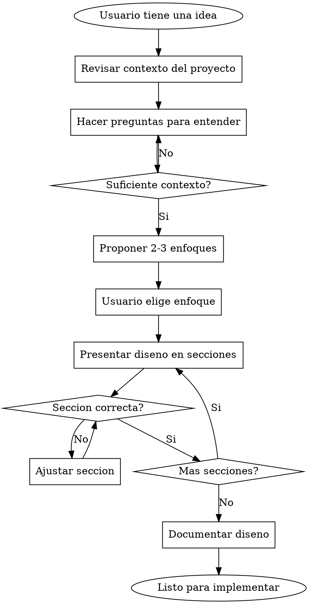

# Brainstorm

## Overview

Convierte ideas en disenos completos a traves de dialogo colaborativo. Antes de escribir codigo, entiende que se quiere construir, explora alternativas, y presenta un diseno validado paso a paso.

## El Proceso



## Fase 1: Entender el contexto

**Antes de preguntar:**
- Revisa el estado actual del proyecto (archivos, estructura)
- Mira commits recientes si hay repositorio git
- Entiende que tecnologias se estan usando

**Hacer preguntas una a la vez:**
- Una sola pregunta por mensaje
- Preferir opciones multiples cuando sea posible
- Si un tema necesita mas exploracion, dividirlo en varias preguntas

**Enfocarse en entender:**
- Proposito: Que problema resuelve esto?
- Restricciones: Hay limitaciones tecnicas o de tiempo?
- Criterios de exito: Como sabemos que esta bien hecho?

## Fase 2: Explorar enfoques

Una vez que entiendes la idea, proponer alternativas:

**Siempre presenta 2-3 enfoques diferentes:**
- Cada enfoque con sus pros y contras
- Lidera con tu recomendacion y explica por que
- Se conversacional, no una lista fria

**Ejemplo:**
```
Para agregar autenticacion, veo tres opciones:

1. **JWT con cookies (Recomendado)**
   - Pro: Simple, sin estado en servidor
   - Pro: Funciona bien con tu stack actual
   - Con: Necesitas manejar refresh tokens

2. **Sesiones en base de datos**
   - Pro: Mas control sobre sesiones activas
   - Con: Mas consultas a la DB

3. **Auth externo (Auth0, Clerk)**
   - Pro: Menos codigo que mantener
   - Con: Dependencia externa, posible costo

Te recomiendo la opcion 1 porque [razon]. Cual prefieres?
```

## Fase 3: Presentar el diseno

**Dividir en secciones de 200-300 palabras:**
- No presentar todo de golpe
- Despues de cada seccion preguntar: "Te parece bien hasta aqui?"
- Estar listo para volver atras y ajustar

**Cubrir estos aspectos:**
1. Arquitectura general
2. Componentes principales
3. Flujo de datos
4. Manejo de errores
5. Consideraciones de testing

**Ser flexible:**
- Si algo no tiene sentido, volver a clarificar
- Ajustar el diseno basado en feedback

## Fase 4: Documentar

**Guardar el diseno validado:**
- Escribir en `docs/plans/YYYY-MM-DD-<tema>-design.md`
- Incluir decisiones tomadas y por que
- Listar los componentes a crear

**Preguntar antes de implementar:**
- "Diseno guardado. Listo para empezar a implementar?"
- Si dice si, sugerir usar `/planificar` para dividir en tareas

## Principios clave

| Principio | Significado |
|-----------|-------------|
| **Una pregunta a la vez** | No abrumar con multiples preguntas |
| **Opciones multiples** | Mas facil responder que preguntas abiertas |
| **YAGNI** | Eliminar features innecesarias del diseno |
| **Explorar alternativas** | Siempre proponer 2-3 enfoques |
| **Validacion incremental** | Presentar en secciones, validar cada una |
| **Flexibilidad** | Volver atras si algo no tiene sentido |

## Ejemplo de interaccion

```
Usuario: Quiero agregar un sistema de favoritos a mi app de recetas

CC-Partner: Buena idea! Primero dejame revisar tu proyecto actual...
[Revisa estructura, tecnologias, modelos existentes]

Veo que tienes un modelo User y Recipe.
Cuando dices "favoritos", que deberia pasar cuando un usuario marca una receta?
1. Solo guardarla en una lista personal
2. Guardarla y poder organizarla en colecciones
3. Guardarla con notas personales

Usuario: 1, solo una lista simple

CC-Partner: Perfecto. Y donde deberia aparecer el boton de favorito?
1. En la tarjeta de receta (vista de lista)
2. Solo en la pagina de detalle de receta
3. En ambos lugares

Usuario: 3

CC-Partner: Entendido. Veo dos enfoques para implementar esto:

**Enfoque A: Tabla de relacion simple (Recomendado)**
- Nueva tabla: user_favorites (user_id, recipe_id, created_at)
- Pro: Simple, eficiente, facil de consultar
- Pro: Funciona bien con tu estructura actual de Prisma

**Enfoque B: Array en el modelo User**
- Campo favorites: Recipe[] en User
- Pro: Menos tablas
- Con: Mas dificil de paginar si hay muchos favoritos

Recomiendo el Enfoque A por escalabilidad. Cual prefieres?

Usuario: A

CC-Partner: Perfecto. Aqui va la primera parte del diseno:

## Modelo de datos

Agregaremos una tabla `UserFavorite`:
- user_id: referencia a User
- recipe_id: referencia a Recipe
- created_at: timestamp

Esto permite consultar facilmente los favoritos de un usuario
y saber cuantos usuarios marcaron cada receta.

Te parece bien esta estructura?

Usuario: Si

CC-Partner: [Continua con siguiente seccion: API endpoints...]
```

## Cuando usar este skill

**Usar /brainstorm cuando:**
- Agregas una nueva feature
- Modificas comportamiento existente
- No tienes claro como implementar algo
- Quieres explorar opciones antes de codear

**NO usar cuando:**
- Es un fix simple o typo
- Ya sabes exactamente que hacer
- Es una tarea puramente mecanica
