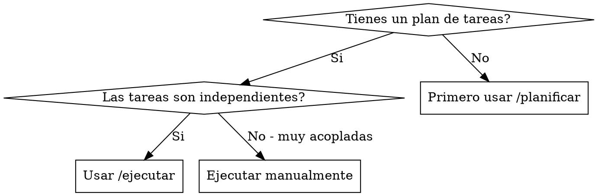
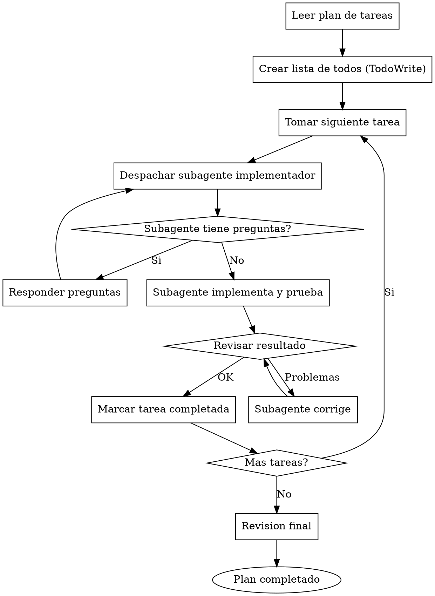

# Ejecutar

## Overview

Ejecuta un plan de tareas usando subagentes. Cada tarea se asigna a un subagente fresco que implementa, prueba, y reporta. Despues de cada tarea, se revisa antes de continuar.

**Principio clave:** Un subagente por tarea + revision despues de cada una = calidad alta, progreso visible.

## Cuando usar



**Usar cuando:**
- Tienes un plan con 3+ tareas definidas
- Las tareas pueden trabajarse de forma independiente
- Quieres progreso rapido con checkpoints de revision

**No usar cuando:**
- Tareas muy acopladas (una depende del resultado exacto de otra)
- Necesitas control manual de cada paso
- Es una sola tarea simple

## El Proceso



## Fase 1: Preparar la ejecucion

**Leer el plan:**
- Abrir `docs/plan.md` o el archivo de plan
- Extraer todas las tareas con su descripcion completa
- Notar el contexto general del proyecto

**Crear TodoWrite:**
- Una entrada por cada tarea
- Estado inicial: `pending`
- Esto da visibilidad del progreso

## Fase 2: Ejecutar tarea por tarea

**Para cada tarea:**

### 1. Despachar subagente implementador

Usar el tool `Task` con un prompt claro:

```markdown
## Tarea: [Nombre de la tarea]

### Contexto
[Descripcion del proyecto y donde encaja esta tarea]

### Objetivo
[Que debe lograr esta tarea especificamente]

### Archivos relevantes
[Lista de archivos que puede necesitar leer o modificar]

### Requisitos
- Implementar [funcionalidad]
- Agregar tests
- Verificar que tests pasan
- Hacer commit con mensaje descriptivo

### Al terminar
Reportar:
1. Que implementaste
2. Que tests agregaste
3. Si encontraste problemas
```

### 2. Responder preguntas

Si el subagente pregunta algo:
- Responder de forma clara y completa
- Proporcionar contexto adicional si es necesario
- No apresurarlo a implementar

### 3. Revisar resultado

Cuando el subagente termina, revisar:
- El codigo implementa lo pedido?
- Los tests pasan?
- El codigo es razonable?

**Si hay problemas:**
- Indicar que debe corregir
- El subagente corrige
- Revisar de nuevo

### 4. Marcar completada

Una vez aprobada:
- Actualizar TodoWrite a `completed`
- Continuar con siguiente tarea

## Fase 3: Revision final

Despues de todas las tareas:
- Ejecutar todos los tests
- Revisar que todo funciona junto
- Hacer commit final si es necesario

## Ejemplo de ejecucion

```
Usuario: /ejecutar

CC-Partner: Voy a ejecutar el plan en docs/plan.md...

[Lee el plan: 4 tareas para sistema de autenticacion]

Creando lista de tareas:
- [ ] 1. Crear modelo User en Prisma
- [ ] 2. API de registro
- [ ] 3. API de login
- [ ] 4. Middleware de auth

## Ejecutando Tarea 1: Crear modelo User

[Despacha subagente]

Subagente: Antes de empezar, que campos necesita el User
ademas de email y password?

CC-Partner: Solo email, password (hasheado), y createdAt.

Subagente: Entendido. Implementando...

[Tiempo despues]

Subagente: Completado:
- Agregue modelo User en schema.prisma
- Corri migracion
- Agregue test de creacion de usuario
- Tests pasan (1/1)
- Commit: "feat: add User model"

CC-Partner: [Revisa] Se ve bien. Tarea 1 completada.

Tareas:
- [x] 1. Crear modelo User en Prisma
- [ ] 2. API de registro
- [ ] 3. API de login
- [ ] 4. Middleware de auth

## Ejecutando Tarea 2: API de registro

[Despacha siguiente subagente...]
```

## Tareas en paralelo

Si hay tareas que pueden ejecutarse en paralelo (sin dependencias):

```
Grupo 1 (paralelo):
  - Tarea A: Crear modelo User
  - Tarea B: Configurar mailer

[Despachar ambos subagentes al mismo tiempo]
[Esperar que ambos terminen]
[Revisar ambos]
[Marcar completadas]

Grupo 2 (depende de Grupo 1):
  - Tarea C: API de registro (usa User y mailer)
```

**Importante:** Solo paralelizar tareas que no tocan los mismos archivos.

## Red Flags - Evitar

| No hagas | Por que |
|----------|---------|
| Saltarte la revision | Errores se acumulan |
| Paralelizar tareas que editan mismo archivo | Conflictos |
| Ignorar preguntas del subagente | Implementacion incorrecta |
| Avanzar con tests fallando | Deuda tecnica |
| Hacer commits sin revisar | Codigo malo en historial |

## Integracion con otros skills

| Situacion | Skill a usar |
|-----------|--------------|
| No tienes plan todavia | `/planificar` primero |
| Tarea muy compleja | `/brainstorm` para disenarla |
| Empezando proyecto nuevo | `/empezar` primero |

## Ventajas de subagentes

**Contexto fresco:**
- Cada subagente empieza limpio
- No arrastra confusion de tareas anteriores

**Paralelizable:**
- Multiples subagentes pueden trabajar a la vez
- En tareas independientes

**Facil de revisar:**
- Cada tarea tiene un resultado claro
- Facil identificar donde hay problemas

**Progreso visible:**
- TodoWrite muestra avance
- Sabes exactamente donde estas
