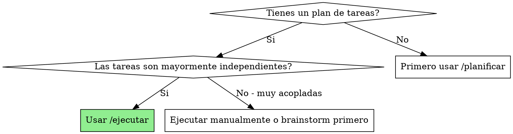
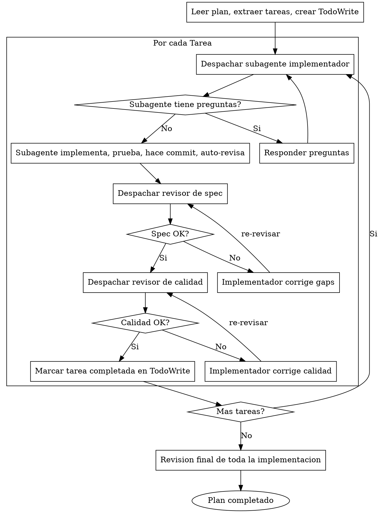

# Ejecutar

## Overview

Ejecuta un plan despachando un subagente fresco por tarea, con revision de dos etapas despues de cada una: primero conformidad con spec, luego calidad de codigo.

**Principio clave:** Subagente fresco por tarea + revision de dos etapas (spec + calidad) = alta calidad, iteracion rapida

## Cuando usar



**Usar cuando:**
- Tienes un plan en `docs/plans/` con tareas definidas
- Las tareas pueden trabajarse de forma independiente
- Quieres progreso rapido con checkpoints de revision

**No usar cuando:**
- Tareas muy acopladas (una depende del resultado exacto de otra)
- Necesitas control manual de cada paso
- No tienes un plan escrito

## El Proceso



## Fase 1: Preparar la ejecucion

**Leer el plan:**
- Abrir el archivo de plan (ej: `docs/plans/2025-01-15-feature.md`)
- Extraer TODAS las tareas con su texto completo
- Notar el contexto general del proyecto

**Crear TodoWrite:**
- Una entrada por cada tarea
- Estado inicial: `pending`
- Esto da visibilidad del progreso

## Fase 2: Ejecutar tarea por tarea

### Para cada tarea:

#### 1. Despachar subagente implementador

Usar el tool `Task` con el prompt de `./implementer-prompt.md`:

```
Task tool (general-purpose):
  description: "Implementar Tarea N: [nombre]"
  prompt: [contenido de implementer-prompt.md con texto completo de tarea]
```

**IMPORTANTE:**
- Pegar texto COMPLETO de la tarea, no hacer que el subagente lea el archivo
- Incluir contexto de donde encaja esta tarea en el plan

#### 2. Responder preguntas

Si el subagente pregunta:
- Responder de forma clara y completa
- Proporcionar contexto adicional si es necesario
- No apresurarlo a implementar

#### 3. Revision de conformidad con spec

Cuando el implementador termina, despachar revisor de spec con `./spec-reviewer-prompt.md`:

```
Task tool (general-purpose):
  description: "Revisar conformidad de Tarea N"
  prompt: [contenido de spec-reviewer-prompt.md]
```

**Si encuentra problemas:**
- El implementador (mismo subagente) corrige
- El revisor revisa de nuevo
- Repetir hasta aprobado

#### 4. Revision de calidad de codigo

Solo despues de que spec pase, despachar revisor de calidad con `./code-quality-reviewer-prompt.md`:

```
Task tool (superpowers:code-reviewer):
  [parametros del prompt]
```

**Si encuentra problemas:**
- El implementador corrige
- El revisor revisa de nuevo
- Repetir hasta aprobado

#### 5. Marcar completada

Una vez aprobada por ambos revisores:
- Actualizar TodoWrite a `completed`
- Continuar con siguiente tarea

## Fase 3: Tareas paralelas

Si el plan marca tareas como PARALELO:

```
## Fase 1 (PARALELO)

[Despachar multiples subagentes implementadores al mismo tiempo]
[Esperar que todos terminen]
[Revisar cada uno (spec + calidad)]
[Marcar completadas]

## Fase 2 (depende de Fase 1)

[Continuar con siguiente fase]
```

**Importante:** Solo paralelizar tareas que:
- No tocan los mismos archivos
- No tienen dependencias de datos
- Estan marcadas como PARALELO en el plan

## Fase 4: Revision final

Despues de todas las tareas:
- Ejecutar todos los tests: `npm test` o equivalente
- Verificar que todo funciona junto
- Hacer commit final si es necesario

## Prompts de Subagentes

Los prompts detallados estan en archivos separados:

- `./implementer-prompt.md` - Para subagente implementador
- `./spec-reviewer-prompt.md` - Para revisor de conformidad
- `./code-quality-reviewer-prompt.md` - Para revisor de calidad

## Ejemplo de ejecucion

```
Tu: Estoy usando /ejecutar para implementar el plan.

[Leer plan: docs/plans/2025-01-15-auth.md]
[Extraer 4 tareas con texto completo]
[Crear TodoWrite]

Tareas:
- [ ] 1. Modelo User en Prisma
- [ ] 2. API de registro
- [ ] 3. API de login
- [ ] 4. Middleware de auth

## Ejecutando Tarea 1: Modelo User

[Despachar subagente implementador con texto completo]

Implementador: "Antes de empezar - el modelo necesita campo 'name' ademas de email?"

Tu: "Solo email y password por ahora."

Implementador: "Entendido. Implementando..."

[Tiempo despues]

Implementador:
- Agregue modelo User en schema.prisma
- Corri migracion
- Agregue test de creacion
- Tests pasan (1/1)
- Auto-revision: Todo bien
- Commit: "feat: add User model"

[Despachar revisor de spec]

Revisor Spec: ✅ Conforme - todos los requisitos cumplidos

[Obtener SHAs de git, despachar revisor de calidad]

Revisor Calidad:
- Fortalezas: Modelo limpio, migracion correcta
- Problemas: Ninguno
- Aprobado

[Marcar Tarea 1 completada]

Tareas:
- [x] 1. Modelo User en Prisma
- [ ] 2. API de registro
- [ ] 3. API de login
- [ ] 4. Middleware de auth

## Ejecutando Tarea 2: API de registro

[Continua...]
```

## Red Flags - NUNCA hacer esto

| No hagas | Por que |
|----------|---------|
| Saltarte revision de spec | Errores de spec se acumulan |
| Saltarte revision de calidad | Codigo malo en produccion |
| Empezar calidad antes de que spec pase | Orden incorrecto |
| Paralelizar tareas que editan mismo archivo | Conflictos |
| Ignorar preguntas del subagente | Implementacion incorrecta |
| Avanzar con tests fallando | Deuda tecnica |
| Hacer commits sin revisar | Codigo malo en historial |
| Hacer que subagente lea archivo de plan | Darle texto completo directamente |
| Continuar si revisor encontro problemas | Arreglar primero, re-revisar |

## Ventajas de Subagentes

**Contexto fresco:**
- Cada subagente empieza limpio
- No arrastra confusion de tareas anteriores

**Paralelizable:**
- Multiples subagentes pueden trabajar a la vez
- En tareas marcadas como PARALELO

**Facil de revisar:**
- Cada tarea tiene un resultado claro
- Revision de dos etapas asegura calidad

**Progreso visible:**
- TodoWrite muestra avance
- Sabes exactamente donde estas

## Integracion con otras skills

| Situacion | Skill a usar |
|-----------|--------------|
| No tienes plan todavia | `/planificar` primero |
| Tarea muy compleja para entender | `/brainstorm` primero |
| Empezando proyecto nuevo | `/empezar` primero |
