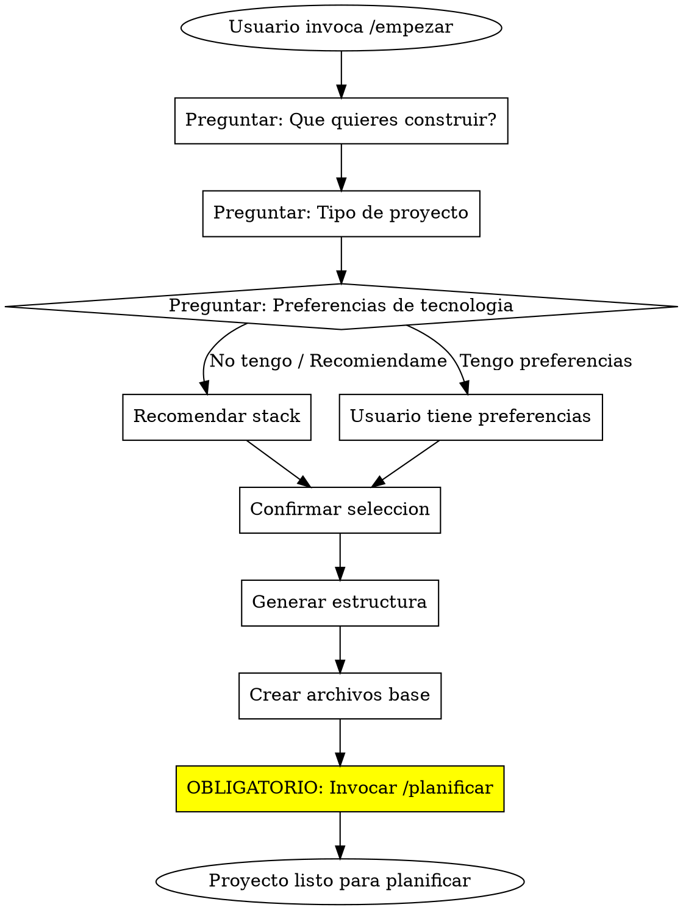

# Empezar Proyecto

## Overview

Guia paso a paso para iniciar un proyecto desde cero. Hace preguntas una a la vez para entender que quieres construir, recomienda tecnologias apropiadas, y genera la estructura inicial del proyecto.

**Principio clave:** Antes de escribir codigo, hay que planificar. Esta skill crea el proyecto y SIEMPRE termina invocando `/planificar`.

## El Proceso



## Fase 1: Entender la idea

**Pregunta 1: La idea**
- "Que quieres construir? Describelo en una frase."
- Espera respuesta antes de continuar
- NO hagas multiples preguntas a la vez

**Pregunta 2: Tipo de proyecto**
Presenta opciones claras:
1. Aplicacion web (frontend + backend)
2. Solo API/backend
3. Script o herramienta CLI
4. Aplicacion movil
5. Bot o automatizacion
6. Otro (especificar)

**Pregunta 3: Preferencias de tecnologia**
- "Tienes preferencia de tecnologias o te recomiendo?"
  1. Recomiendame (para principiantes)
  2. Tengo preferencias especificas

## Fase 2: Recomendar tecnologias

Si el usuario pidio recomendacion, sugiere un stack basado en:

| Tipo de proyecto | Stack recomendado para principiantes |
|------------------|--------------------------------------|
| Web app simple | React + Vite, Node.js + Express, SQLite |
| Web app con auth | Next.js, Prisma, PostgreSQL |
| Solo API | Node.js + Express, SQLite |
| CLI tool | Node.js o Python |
| Bot Discord/Telegram | Node.js + libreria especifica |
| Automatizacion | Python |

**Presenta la recomendacion y pregunta:**
- "Para [tipo de proyecto], te recomiendo: [stack]. Te parece bien o prefieres algo diferente?"

## Fase 3: Generar el proyecto

Una vez confirmado el stack:

1. **Crear estructura de carpetas**
   ```
   proyecto/
   ├── src/
   ├── docs/
   │   └── plans/      # Aqui van los planes de implementacion
   ├── README.md
   └── [archivos de config segun stack]
   ```

2. **Generar archivos base**
   - package.json / requirements.txt segun lenguaje
   - Configuracion basica (tsconfig, .env.example, etc.)
   - README.md con descripcion del proyecto

3. **Crear carpeta docs/plans/**
   - Esta carpeta es donde `/planificar` guardara los planes
   - Crear .gitkeep para asegurar que exista

## Fase 4: OBLIGATORIO - Invocar /planificar

**NUNCA terminar /empezar sin invocar /planificar**

Al terminar la estructura:

```
Proyecto creado! He creado:
- Estructura de carpetas
- Archivos de configuracion
- Carpeta docs/plans/ para los planes de implementacion

Ahora voy a usar /planificar para crear el plan de implementacion...
```

**Luego DEBES usar el tool Skill para invocar `/planificar`:**

```
Skill tool:
  skill: "cc-partner:planificar"
```

## Red Flags - NUNCA hacer esto

| No hagas | Por que |
|----------|---------|
| Terminar sin invocar /planificar | Siempre se necesita un plan antes de implementar |
| Empezar a escribir codigo | /empezar solo crea estructura, /planificar + /ejecutar implementan |
| Ofrecer "empezar a implementar" | El usuario debe revisar el plan primero |
| Saltarte la creacion de docs/plans/ | Es donde van los planes |

## Principios clave

- **Una pregunta a la vez** - No abrumar con multiples preguntas
- **Opciones claras** - Preferir multiple choice sobre preguntas abiertas
- **Explicar el por que** - Cuando recomiendas algo, explica brevemente por que
- **YAGNI** - No agregar complejidad innecesaria, empezar simple
- **Validar cada paso** - Confirmar antes de avanzar
- **SIEMPRE planificar** - Esta skill DEBE terminar invocando /planificar

## Ejemplo de interaccion

```
Usuario: /empezar

CC-Partner: Que quieres construir? Describelo en una frase.

Usuario: Una app para guardar y organizar recetas de cocina

CC-Partner: Excelente idea! Que tipo de proyecto seria?
1. Aplicacion web (frontend + backend)
2. Solo API/backend
3. Aplicacion movil
4. Otro

Usuario: 1

CC-Partner: Tienes preferencia de tecnologias o te recomiendo un stack?
1. Recomiendame (ideal si estas empezando)
2. Tengo preferencias especificas

Usuario: 1

CC-Partner: Para una app de recetas, te recomiendo:
- Frontend: React + Vite (rapido y facil de aprender)
- Backend: Node.js + Express (mismo lenguaje que frontend)
- Base de datos: SQLite (sin configuracion, perfecto para empezar)

Te parece bien?

Usuario: Si

CC-Partner: Perfecto! Creando la estructura del proyecto...

[Genera carpetas, archivos, y estructura]

Proyecto creado! He creado:
- Estructura de carpetas (src/, docs/plans/)
- Archivos de configuracion
- README.md

Ahora voy a crear el plan de implementacion...

[INVOCA /planificar automaticamente]
```

## Notas para diferentes audiencias

**Para principiantes:**
- Usa lenguaje simple, evita jerga tecnica
- Explica brevemente que hace cada tecnologia
- Recomienda opciones con menor curva de aprendizaje

**Para desarrolladores:**
- Puedes ser mas directo
- Acepta preferencias especificas sin cuestionar
- Ofrece opciones mas avanzadas si las piden
