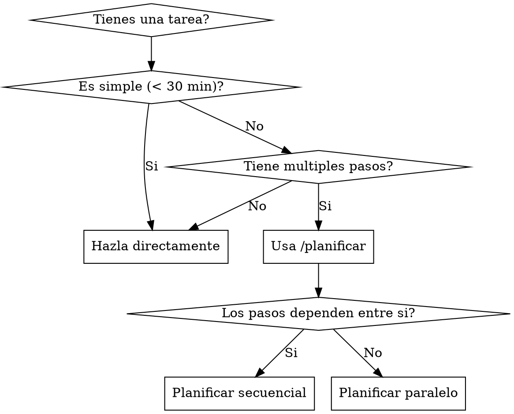

# Planificar

## Overview

Divide tareas complejas en subtareas manejables. Analiza dependencias entre tareas, identifica cuales pueden ejecutarse en paralelo, y crea un plan de ejecucion claro.

**Principio clave:** Antes de ejecutar, planificar. Una tarea bien dividida es mas facil de completar y revisar.

## Cuando usar



**Usar cuando:**
- Tarea tiene 3+ pasos distintos
- No esta claro por donde empezar
- Quieres dividir trabajo para ejecutar con subagentes
- Necesitas estimar el alcance del trabajo

**No usar cuando:**
- Tarea simple y directa
- Ya tienes claro que hacer
- Es un fix rapido

## El Proceso

### Fase 1: Analizar la tarea

**Entender el objetivo:**
- Cual es el resultado final esperado?
- Hay restricciones o requisitos especificos?
- Que ya existe que podemos reutilizar?

**Identificar componentes:**
- Que partes necesitan crearse o modificarse?
- Hay dependencias externas (APIs, librerias)?
- Que archivos se veran afectados?

### Fase 2: Dividir en subtareas

**Cada subtarea debe ser:**
- **Independiente:** Puede completarse sin esperar otras (idealmente)
- **Pequena:** Maximo 30-60 minutos de trabajo
- **Clara:** Objetivo especifico y medible
- **Verificable:** Sabes cuando esta terminada

**Formato de subtarea:**
```markdown
## Tarea: [Nombre descriptivo]
- **Objetivo:** Que debe lograr esta tarea
- **Archivos:** Que archivos crea o modifica
- **Dependencias:** Que tareas deben completarse antes
- **Verificacion:** Como saber que esta lista
```

### Fase 3: Ordenar por dependencias

**Identificar dependencias:**
```
Tarea A: Crear modelo de datos
Tarea B: Crear API endpoints (depende de A)
Tarea C: Crear componente UI (depende de B)
Tarea D: Agregar tests (depende de A, B, C)
```

**Agrupar tareas paralelas:**
```
Grupo 1 (paralelo):
  - Tarea A: Modelo de datos
  - Tarea E: Configurar linting

Grupo 2 (paralelo, despues de Grupo 1):
  - Tarea B: API endpoints
  - Tarea F: Setup de tests

Grupo 3 (secuencial):
  - Tarea C: Componente UI
  - Tarea D: Escribir tests
```

### Fase 4: Documentar el plan

**Guardar en `docs/plan.md`:**

```markdown
# Plan: [Nombre del proyecto/feature]

## Objetivo
[Que se quiere lograr]

## Tareas

### Fase 1: Fundamentos
| Tarea | Descripcion | Dependencias | Paralela? |
|-------|-------------|--------------|-----------|
| A | Crear modelo | Ninguna | Si |
| E | Config lint | Ninguna | Si |

### Fase 2: Backend
| Tarea | Descripcion | Dependencias | Paralela? |
|-------|-------------|--------------|-----------|
| B | API endpoints | A | Si |
| F | Setup tests | A | Si |

### Fase 3: Frontend
| Tarea | Descripcion | Dependencias | Paralela? |
|-------|-------------|--------------|-----------|
| C | Componente UI | B | No |
| D | Tests E2E | B, C | No |

## Notas
[Consideraciones especiales, riesgos, decisiones]
```

## Ejemplo de interaccion

```
Usuario: /planificar

Quiero agregar autenticacion a mi app

CC-Partner: Voy a analizar tu proyecto para crear un plan...
[Revisa estructura, tecnologias existentes]

Veo que usas Next.js con Prisma. Para autenticacion completa,
identifico estas subtareas:

## Plan: Sistema de Autenticacion

### Fase 1: Base de datos (paralelas)
| Tarea | Descripcion |
|-------|-------------|
| 1.1 | Crear modelo User en Prisma |
| 1.2 | Crear modelo Session |
| 1.3 | Configurar variables de entorno |

### Fase 2: Backend (secuenciales)
| Tarea | Descripcion | Depende de |
|-------|-------------|------------|
| 2.1 | API: registro de usuario | 1.1 |
| 2.2 | API: login | 1.1, 1.2 |
| 2.3 | API: logout | 1.2 |
| 2.4 | Middleware de autenticacion | 2.2 |

### Fase 3: Frontend (secuenciales)
| Tarea | Descripcion | Depende de |
|-------|-------------|------------|
| 3.1 | Formulario de registro | 2.1 |
| 3.2 | Formulario de login | 2.2 |
| 3.3 | Boton de logout | 2.3 |
| 3.4 | Proteger rutas privadas | 2.4 |

### Fase 4: Testing
| Tarea | Descripcion |
|-------|-------------|
| 4.1 | Tests de API |
| 4.2 | Tests de componentes |

Te parece bien este plan? Puedo ajustar si necesitas
agregar o quitar algo.

Usuario: Si, perfecto

CC-Partner: Plan guardado en docs/plan.md

Quieres que empecemos a ejecutar? Puedo:
1. Ejecutar tarea por tarea (tu revisas cada una)
2. Usar /ejecutar para las tareas paralelas con subagentes
3. Empezar con la Fase 1 manualmente

Que prefieres?
```

## Integracion con otros skills

| Despues de planificar... | Usa |
|--------------------------|-----|
| Ejecutar tareas paralelas | `/ejecutar` |
| Disenar una tarea compleja | `/brainstorm` |
| Empezar proyecto nuevo | `/empezar` |

## Tips para buenos planes

**Tareas demasiado grandes:**
- Si una tarea toma mas de 1 hora, dividirla mas

**Tareas demasiado pequenas:**
- Si son triviales (< 5 min), agruparlas

**Dependencias circulares:**
- Si A depende de B y B de A, hay un problema de diseno
- Volver a `/brainstorm` para redisenar

**Cambios de plan:**
- Es normal ajustar el plan mientras se ejecuta
- Actualizar `docs/plan.md` con cambios
