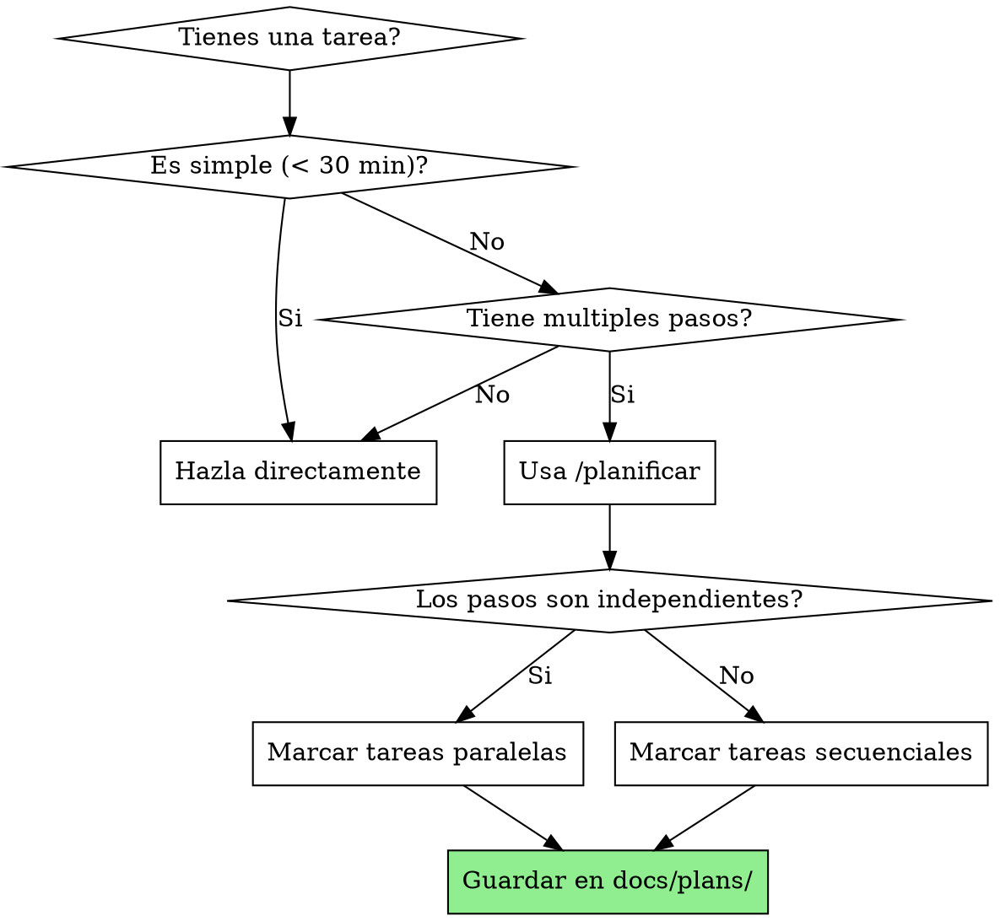

# Planificar

## Overview

Escribe planes de implementacion completos asumiendo que el ingeniero no tiene contexto del codebase. Documenta todo lo necesario: archivos a tocar, codigo, tests, como verificar. Divide en tareas pequenas. DRY. YAGNI. TDD. Commits frecuentes.

**Principio clave:** Antes de ejecutar, planificar. Un plan bien escrito permite ejecutar con subagentes de forma autonoma.

**Guardar planes en:** `docs/plans/YYYY-MM-DD-<nombre-feature>.md`

## Cuando usar



**Usar cuando:**
- Tarea tiene 3+ pasos distintos
- No esta claro por donde empezar
- Quieres dividir trabajo para ejecutar con subagentes
- Necesitas estimar el alcance del trabajo

**No usar cuando:**
- Tarea simple y directa
- Ya tienes claro que hacer
- Es un fix rapido

## Header Obligatorio del Plan

**Cada plan DEBE empezar con este header:**

```markdown
# [Nombre Feature] - Plan de Implementacion

> **Para Claude:** Usa `/ejecutar` para implementar este plan tarea por tarea.

**Objetivo:** [Una frase describiendo que se construye]

**Arquitectura:** [2-3 frases sobre el enfoque]

**Stack:** [Tecnologias/librerias clave]

---
```

## Granularidad de Tareas (Bite-Sized)

**Cada paso es UNA accion (2-5 minutos):**

```markdown
### Tarea 1: [Nombre del Componente]

**Archivos:**
- Crear: `ruta/exacta/al/archivo.py`
- Modificar: `ruta/exacta/existente.py:123-145`
- Test: `tests/ruta/exacta/test.py`

**Paso 1: Escribir el test que falla**

\`\`\`python
def test_comportamiento_especifico():
    resultado = funcion(input)
    assert resultado == esperado
\`\`\`

**Paso 2: Ejecutar test para verificar que falla**

Ejecutar: `pytest tests/ruta/test.py::test_name -v`
Esperado: FAIL con "funcion not defined"

**Paso 3: Implementar codigo minimo**

\`\`\`python
def funcion(input):
    return esperado
\`\`\`

**Paso 4: Ejecutar test para verificar que pasa**

Ejecutar: `pytest tests/ruta/test.py::test_name -v`
Esperado: PASS

**Paso 5: Commit**

\`\`\`bash
git add tests/ruta/test.py src/ruta/archivo.py
git commit -m "feat: add specific feature"
\`\`\`
```

## Identificar Tareas Paralelas

**Agrupar tareas que pueden ejecutarse simultaneamente:**

```markdown
## Fase 1: Fundamentos (PARALELO)

Las siguientes tareas son independientes y pueden ejecutarse en paralelo:

| Tarea | Descripcion | Archivos |
|-------|-------------|----------|
| 1.1 | Crear modelo de datos | `src/models/user.py` |
| 1.2 | Configurar linting | `.eslintrc.js` |
| 1.3 | Setup de tests | `pytest.ini`, `conftest.py` |

## Fase 2: Backend (SECUENCIAL - depende de Fase 1)

Estas tareas dependen entre si y deben ejecutarse en orden:

| Tarea | Descripcion | Depende de |
|-------|-------------|------------|
| 2.1 | API de registro | 1.1 |
| 2.2 | API de login | 2.1 |
| 2.3 | Middleware auth | 2.2 |
```

## El Proceso

### Fase 1: Analizar la tarea

**Entender el objetivo:**
- Cual es el resultado final esperado?
- Hay restricciones o requisitos especificos?
- Que ya existe que podemos reutilizar?

**Identificar componentes:**
- Que partes necesitan crearse o modificarse?
- Hay dependencias externas (APIs, librerias)?
- Que archivos se veran afectados?

### Fase 2: Dividir en subtareas

**Cada subtarea debe ser:**
- **Independiente:** Puede completarse sin esperar otras (idealmente)
- **Pequena:** Maximo 30-60 minutos de trabajo
- **Clara:** Objetivo especifico y medible
- **Verificable:** Sabes cuando esta terminada
- **Con codigo completo:** No decir "agregar validacion", escribir el codigo

### Fase 3: Ordenar por dependencias

**Identificar que puede ser paralelo:**
- Tareas que no tocan los mismos archivos
- Tareas sin dependencia de datos entre ellas
- Diferentes subsistemas

**Marcar explicitamente:**
```markdown
## Fase N: [Nombre] (PARALELO/SECUENCIAL)
```

### Fase 4: Guardar el plan

**Nombre del archivo:** `docs/plans/YYYY-MM-DD-<nombre-feature>.md`

Ejemplo: `docs/plans/2025-01-15-sistema-autenticacion.md`

## Oferta de Ejecucion

**Despues de guardar el plan, ofrecer:**

```
Plan guardado en `docs/plans/YYYY-MM-DD-nombre.md`.

Quieres que ejecute el plan?

1. **Ejecutar ahora** - Uso `/ejecutar` para implementar tarea por tarea con subagentes
2. **Revisar primero** - Tu revisas el plan y me dices cuando empezar

Que prefieres?
```

**Si elige ejecutar:**
- Usar tool Skill para invocar `/ejecutar`

## Ejemplo Completo

```markdown
# Sistema de Autenticacion - Plan de Implementacion

> **Para Claude:** Usa `/ejecutar` para implementar este plan tarea por tarea.

**Objetivo:** Implementar registro, login, logout con JWT

**Arquitectura:** API REST con Express, autenticacion JWT, passwords con bcrypt

**Stack:** Node.js, Express, Prisma, PostgreSQL, bcrypt, jsonwebtoken

---

## Fase 1: Base de Datos (PARALELO)

Las siguientes tareas son independientes:

### Tarea 1.1: Modelo User

**Archivos:**
- Modificar: `prisma/schema.prisma`

**Paso 1: Agregar modelo User**

\`\`\`prisma
model User {
  id        Int      @id @default(autoincrement())
  email     String   @unique
  password  String
  createdAt DateTime @default(now())
}
\`\`\`

**Paso 2: Ejecutar migracion**

Ejecutar: `npx prisma migrate dev --name add-user`
Esperado: Migration applied

**Paso 3: Commit**

\`\`\`bash
git add prisma/
git commit -m "feat: add User model"
\`\`\`

### Tarea 1.2: Configurar variables de entorno

**Archivos:**
- Crear: `.env.example`
- Modificar: `.gitignore`

**Paso 1: Crear .env.example**

\`\`\`
DATABASE_URL="postgresql://..."
JWT_SECRET="your-secret-here"
\`\`\`

**Paso 2: Verificar .gitignore tiene .env**

**Paso 3: Commit**

---

## Fase 2: API Endpoints (SECUENCIAL - depende de Fase 1)

### Tarea 2.1: Endpoint de registro

**Archivos:**
- Crear: `src/routes/auth.ts`
- Test: `tests/routes/auth.test.ts`

**Paso 1: Escribir test que falla**

\`\`\`typescript
describe('POST /auth/register', () => {
  it('should create a new user', async () => {
    const res = await request(app)
      .post('/auth/register')
      .send({ email: 'test@test.com', password: 'password123' });

    expect(res.status).toBe(201);
    expect(res.body).toHaveProperty('id');
  });
});
\`\`\`

**Paso 2: Ejecutar test**

Ejecutar: `npm test -- auth.test.ts`
Esperado: FAIL

**Paso 3: Implementar endpoint**

\`\`\`typescript
import { Router } from 'express';
import bcrypt from 'bcrypt';
import { prisma } from '../db';

const router = Router();

router.post('/register', async (req, res) => {
  const { email, password } = req.body;
  const hashedPassword = await bcrypt.hash(password, 10);

  const user = await prisma.user.create({
    data: { email, password: hashedPassword }
  });

  res.status(201).json({ id: user.id, email: user.email });
});

export default router;
\`\`\`

**Paso 4: Ejecutar test**

Ejecutar: `npm test -- auth.test.ts`
Esperado: PASS

**Paso 5: Commit**

\`\`\`bash
git add src/routes/auth.ts tests/routes/auth.test.ts
git commit -m "feat: add register endpoint"
\`\`\`

[...continua con mas tareas...]
```

## Tips para Buenos Planes

**Tareas demasiado grandes:**
- Si una tarea toma mas de 1 hora, dividirla mas

**Tareas demasiado pequenas:**
- Si son triviales (< 5 min), agruparlas

**Dependencias circulares:**
- Si A depende de B y B de A, hay un problema de diseno
- Volver a `/brainstorm` para redisenar

**Cambios de plan:**
- Es normal ajustar el plan mientras se ejecuta
- Actualizar el archivo del plan con cambios

## Recuerda

- Rutas de archivos exactas siempre
- Codigo completo en el plan (no "agregar validacion")
- Comandos exactos con output esperado
- DRY, YAGNI, TDD, commits frecuentes
- Marcar PARALELO vs SECUENCIAL explicitamente
